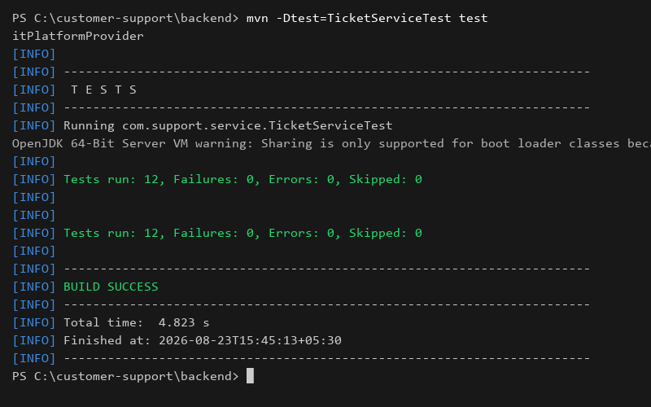
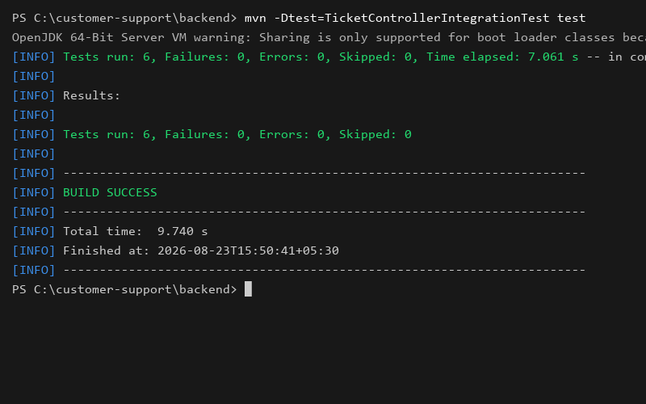
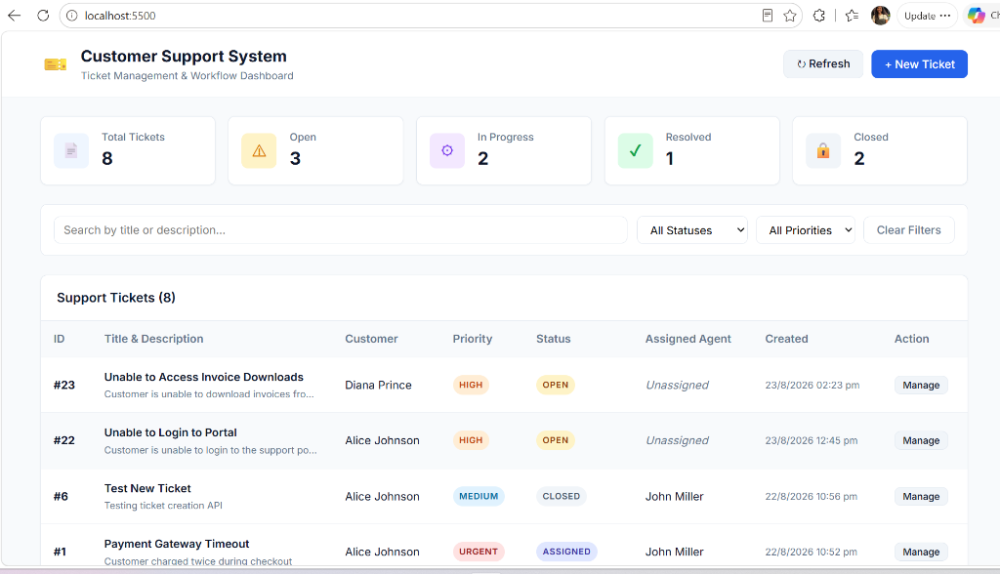
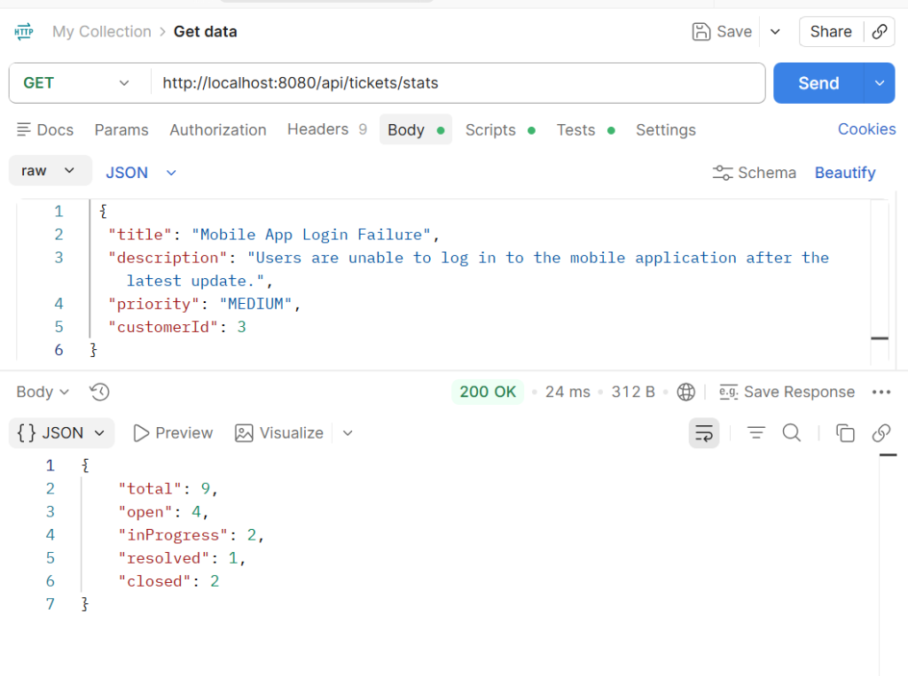
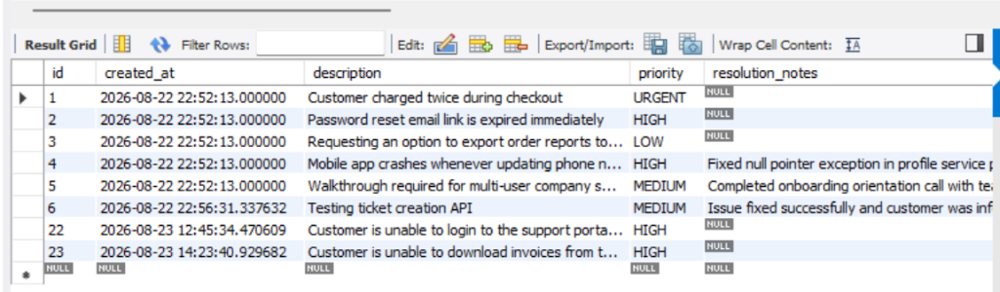

# Customer Support Ticket System

A comprehensive Customer Support Ticket Management application built using Java 17, Spring Boot 3, Spring Data JPA, Maven, MySQL, and Vanilla HTML/CSS/JavaScript.

---

# 1. Project Overview

The Customer Support Ticket System is a web-based application that enables customer support teams to create, manage, assign, resolve, and close customer tickets through a structured workflow.

The application enforces business rules for ticket lifecycle management and provides a dashboard for tracking ticket statistics and support activities.

---

# 2. Technology Stack

| Component          | Technology                |
|--------------------|---------------------------|
| Backend            | Java 17                   |
| Framework          | Spring Boot 3.2.5         |
| ORM                | Spring Data JPA           |
| Database           | MySQL 8.x                 |
| Build Tool         | Maven                     |
| Frontend           | HTML5, CSS3, JavaScript   |
| API Testing        | Postman                   |
| Unit Testing       | JUnit 5, Mockito          |
| Integration Testing| Spring Boot Test, MockMvc |
| IDE                | Visual Studio Code        |

---

# 3. Project Structure

```text
customer-support-ticket-system/

├── backend/
│   ├── src/main/java
│   ├── src/main/resources
│   └── src/test/java
│
├── frontend/
│   ├── index.html
│   ├── css/
│   └── js/
│
├── database/
│   ├── schema.sql
│   ├── data.sql
│   └── queries.sql
│
├── testing/
│   ├── test-plan/
│   ├── test-cases/
│   ├── api-testing/
│   ├── sql-testing/
│   ├── ui-testing/
│   └── test-summary/
│
├── docs/
│
└── README.md
```

---

# 4. Features

### Ticket Management

- Create Support Tickets
- View All Tickets
- View Ticket Details
- Assign Tickets to Agents
- Update Ticket Status
- Resolve Tickets
- Close Tickets

### Dashboard Features

- Total Tickets Count
- Open Tickets Count
- In Progress Tickets Count
- Resolved Tickets Count
- Closed Tickets Count

### Search & Filtering

- Search Tickets
- Filter by Status
- Filter by Priority
- Filter by Assigned Agent

### Validation Rules

- Mandatory field validation
- Agent existence validation
- Status transition validation
- Resolution notes validation
- Closed ticket protection

---

# 5. Ticket Workflow

```text
OPEN
   ↓
ASSIGNED
   ↓
IN_PROGRESS
   ↓
RESOLVED
   ↓
CLOSED
```

### Business Rules

1. Ticket must start in OPEN state.

2. Ticket can only move through the defined workflow.

3. Agent assignment is mandatory before moving to IN_PROGRESS.

4. Resolution notes are mandatory before RESOLVED.

5. CLOSED tickets cannot be modified or reopened.

---

# 6. How to Run the Application

## Step 1: Configure Database

Update database configuration in:

```properties
src/main/resources/application.properties
```

Example:

```properties
spring.datasource.url=jdbc:mysql://localhost:3306/customer_support
spring.datasource.username=root
spring.datasource.password=root
```

---

## Step 2: Run Backend

```bash
cd backend

mvn clean install

mvn spring-boot:run
```

Application starts at:

```text
http://localhost:8080
```

---

## Step 3: Open Application

Open browser:

```text
http://localhost:8080
```

---

## Frontend Information

The frontend is developed using:

- HTML5
- CSS3
- Vanilla JavaScript

Frontend source files are located in:

```text
frontend/
├── index.html
├── css/
└── js/
```

The frontend dashboard communicates with Spring Boot REST APIs using JavaScript Fetch API calls.

For deployment simplicity, the UI is served directly through the Spring Boot application from:

```text
backend/src/main/resources/static/
```

No separate frontend server or build process is required.

---

## Accessing the Application

After starting the Spring Boot application, open:

```text
http://localhost:8080
```

The Customer Support Dashboard will load automatically and provide access to:

- Ticket Dashboard
- Ticket Creation
- Ticket Assignment
- Status Updates
- Search & Filtering
- Dashboard Statistics

# 7. REST API Summary

| Method| Endpoint                 | Description         |
|-------|--------------------------|---------------------|
| POST  | /api/tickets             | Create Ticket       |
| GET   | /api/tickets             | Get All Tickets     |
| GET   | /api/tickets/{id}        | Get Ticket By ID    |
| PUT   | /api/tickets/{id}/assign | Assign Ticket       |
| PUT   | /api/tickets/{id}/status | Update Status       |
| PUT   | /api/tickets/{id}/resolve| Resolve Ticket      |
| PUT   | /api/tickets/{id}/close  | Close Ticket        |
| GET   | /api/tickets/search      | Search Tickets      |
| GET   | /api/tickets/stats       | Dashboard Statistics|
| GET   | /api/customers           | Get Customers       |
| GET   | /api/agents              | Get Agents          |

Complete API details are available in:

```text
docs/API_Documentation.md
```

---

# 8. Database Queries

The project includes SQL query solutions for reporting and analytics.

### Queries Implemented

- Tickets by Priority
- Tickets by Agent
- Open Tickets Report
- Average Tickets per Agent
- Highest Priority Unresolved Tickets

Location:

```text
database/queries.sql
```

---

# 9. Testing Overview

Testing was performed across multiple layers of the application to validate functionality, business rules, APIs, database operations, and frontend behavior.

### Testing Areas Covered

- Functional Testing
- Business Rule Validation
- REST API Testing
- Database Testing
- UI Testing
- Unit Testing
- Integration Testing

### Test Artifacts

| Document                      | Purpose                   |
|-------------------------------|---------------------------|
| Test_Plan.md                  | Testing Strategy          |
| API_Documentation.md          | API Reference             |
| Dashboard_TestCases.md        | Dashboard Validation      |
| UI_Test_Cases.md              | Frontend Testing          |
| SQL_Test_Cases.md             | Database Testing          |
| Ticket_Creation_TestCases.md  | Ticket Creation Validation|
| Ticket_Assignment_TestCases.md| Assignment Validation     |
| Status_Transition_TestCases.md| Workflow Validation       |

---

# 10. Automated Test Results

## Unit Testing

### Test Class

```text
TicketServiceTest
```

### Execution Command

```bash
mvn -Dtest=TicketServiceTest test
```

### Result

```text
Tests Run: 12
Failures: 0
Errors: 0
Skipped: 0

BUILD SUCCESS
```

---

## Integration Testing

### Test Class

```text
TicketControllerIntegrationTest
```

### Execution Command

```bash
mvn -Dtest=TicketControllerIntegrationTest test
```

### Result

```text
Tests Run: 6
Failures: 0
Errors: 0
Skipped: 0

BUILD SUCCESS
```

---

## Automated Testing Summary

| Test Suite                     | Total Tests | Passed | Failed |
|--------------------------------|-------------|--------|--------|
| TicketServiceTest              | 12          | 12     | 0      |
| TicketControllerIntegrationTest| 6           | 6      | 0      |
| Total                          | 18          | 18     | 0      |

### Automated Test Screenshots

- **Unit Test Execution**:


- **Integration Test Execution**:


---

# 11. Manual Testing Summary

The following functionality was manually verified using the application UI, Postman, and MySQL.

### Verified Features

- Ticket Creation
- Ticket Assignment
- Status Update Workflow
- Ticket Resolution
- Ticket Closure
- Dashboard Statistics
- Status Filtering
- Priority Filtering
- API Validation
- Database Persistence
- Error Handling

### Tools Used

- Postman
- MySQL Workbench
- Google Chrome
- Spring Boot Application

### Visual Evidence & Screenshots

- **UI Dashboard**:


- **UI Ticket Creation**:


- **API Create Ticket**:


- **Dashboard Stats**:


- **Database Validation**:


---

# 12. Assumptions

The following assumptions were considered during development and testing:

- Application is running in a local environment.
- MySQL database is configured correctly.
- Seed data is loaded successfully.
- APIs are accessible through localhost.
- Users have access to all application functionality.
- Functional testing is the primary scope.
- Performance and security testing are outside the assignment scope.

---

# 13. Test Deliverables

The following deliverables are included with the project:

- README.md
- Test_Plan.md
- API_Documentation.md
- Dashboard_TestCases.md
- UI_Test_Cases.md
- SQL_Test_Cases.md
- JUnit Test Results
- Integration Test Results
- Postman Validation Results
- UI Screenshots
- Defect Verification Notes

---

# 14. Conclusion

The Customer Support Ticket System was successfully tested across the UI, API, database, service layer, and integration layer.

The following areas were validated successfully:

- Ticket Creation
- Ticket Assignment
- Ticket Workflow Transitions
- Resolution Validation
- Closed Ticket Restrictions
- Dashboard Statistics
- Database Persistence
- API Functionality
- UI Functionality

### Final Test Results

```text
Unit Tests Passed: 12/12
Integration Tests Passed: 6/6
Total Tests Passed: 18/18
```

The application satisfies the functional, database, API, and testing requirements defined for the assignment and is ready for submission.