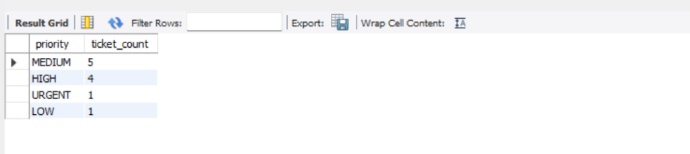
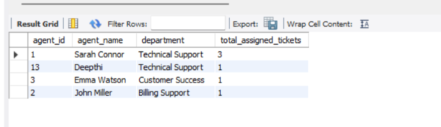
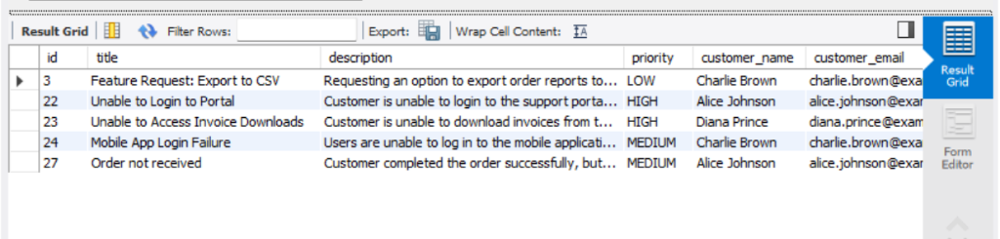
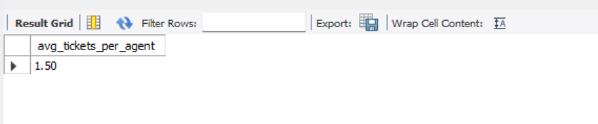
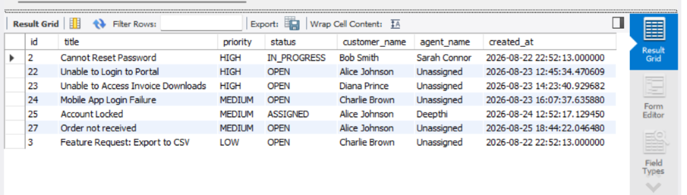

# SQL Test Cases & Validation

## SQL Test Execution Summary

| Total Queries Tested | Passed | Failed | Status |
|----------------------|--------|--------|---------|
| 5                    |  5     |   0    | PASS    |

---

## SQL Test Cases

| Test ID       | Scenario                        | Result |
|---------------|---------------------------------|--------|
| TC_SQL_01     | Tickets by Priority             | PASS   |
| TC_SQL_02     | Tickets by Agent                | PASS   |
| TC_SQL_03     | Open Tickets Report             | PASS   |
| TC_SQL_04     | Average Tickets per Agent       | PASS   |
| TC_SQL_05     | Highest Priority Unresolved Tickets | PASS   |

---

## Validation Details

### TC_SQL_01 – Tickets by Priority
- Verified ticket counts are grouped correctly by priority.
- Total count matches records in the tickets table.
- Result: PASS

### TC_SQL_02 – Tickets by Agent
- Verified ticket count for each agent.
- Agents without assigned tickets are also displayed.
- Result: PASS

### TC_SQL_03 – Open Tickets Report
- Verified only OPEN tickets are returned.
- Customer information is displayed correctly.
- Result: PASS

### TC_SQL_04 – Average Tickets per Agent
- Verified average ticket calculation.
- Result matches expected database values.
- Result: PASS

### TC_SQL_05 – Highest Priority Unresolved Tickets
- Verified RESOLVED and CLOSED tickets are excluded.
- Verified sorting order: URGENT → HIGH → MEDIUM → LOW.
- Result: PASS

## Validation Coverage

### Ticket Analytics
- Tickets grouped by priority
- Tickets assigned per agent
- Open ticket reporting

### Business Reporting
- Average tickets per agent
- Highest priority unresolved tickets

### Database Validation
- Table relationships verified
- Join operations verified
- Aggregate functions verified
- Sorting and filtering logic verified

---

## Database Testing Evidence

### Query 1 – Tickets by Priority

---

### Query 2 – Tickets by Agent

---

### Query 3 – Open Tickets

---

### Query 4 – Average Tickets per Agent

---

### Query 5 – Highest Priority Unresolved Tickets

---

## SQL Testing Result

All SQL queries executed successfully and returned expected results.

- Total Queries Tested: 5
- Passed: 5
- Failed: 0
- Database Relationships Verified
- Query Results Validated
- Business Reporting Verified

**Final Status: PASS**