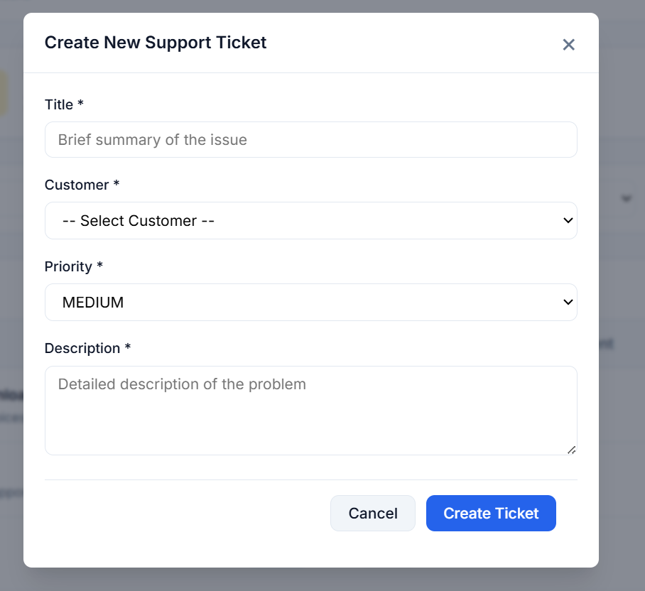
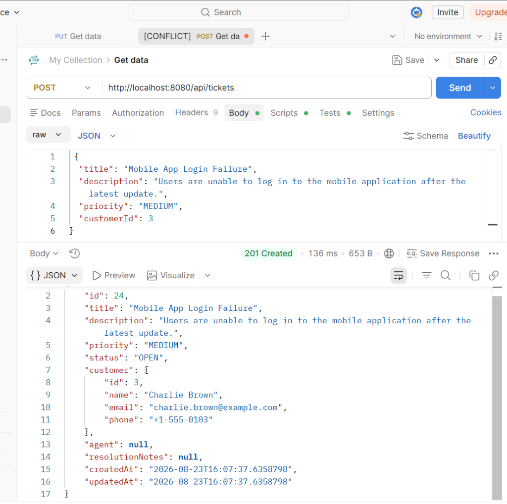

# Test Cases: Ticket Creation

## Test Execution Summary

| Total Test Cases | Passed  | Failed  | Result |
|------------------|---------|---------|--------|
| 6                | 6       | 0       | PASS   |

---

## Detailed Test Cases

| Test ID  | Test Scenario                         | Status |
|----------|-------------------------------------- |--------|
| TC_TC_01 | Create ticket with valid data         | PASS   |
| TC_TC_02 | Create ticket with empty title        | PASS   |
| TC_TC_03 | Create ticket with empty description  | PASS   |
| TC_TC_04 | Create ticket with invalid customer ID| PASS   |
| TC_TC_05 | Create ticket without priority        | PASS   |
| TC_TC_06 | Create ticket using UI form           | PASS   |

---

## Validation Performed

✓ Ticket is created successfully with OPEN status

✓ Ticket ID is generated automatically

✓ Title field validation is verified

✓ Description field validation is verified

✓ Priority field validation is verified

✓ Customer existence validation is verified

✓ UI form submission is working correctly

✓ Dashboard updates successfully after ticket creation

✓ API response returns correct status and payload

---

## Test Result

Ticket creation functionality has been tested successfully through both API and UI workflows. All validation rules, business requirements, and data persistence checks passed without defects.

---

## Screenshot Evidence

### UI Ticket Creation

### API Ticket Creation

